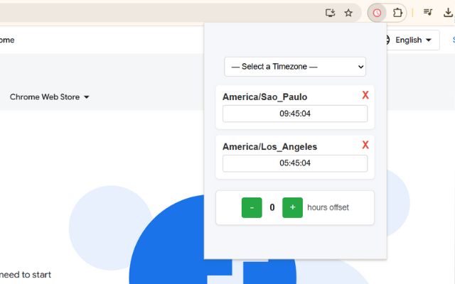

🌍 World Clock Tracker - Chrome Extension ⏰

A lightweight and customizable Chrome extension to track multiple time zones effortlessly. Whether you collaborate with teams worldwide or have family and friends in different locations, this extension makes it easy to stay synchronized!

✨ Features

Easily Track Multiple Timezones: Quickly add or remove any timezone you need.

Adjustable Time Offset: Handy feature to view future or past times across all selected zones.

Persistent Storage: Remembers your selected time zones using local storage.

Simple and Clean UI: Minimalistic design to keep things clear and intuitive.

🚀 Getting Started

Option 1: Chrome Web Store (Pending Approval)

The extension will soon be available directly from the Chrome Web Store.

Option 2: Manual Installation

You can easily set it up manually using Chrome's developer mode:

Clone or download this repository:

git clone https://github.com/murilotoloni/world-clock-tracker.git

Open Chrome and navigate to chrome://extensions/.

Enable Developer mode (top right corner).

Click Load unpacked and select the cloned folder.

That's it! 🎉

🛠️ Customization

To add a timezone, select it from the dropdown menu.

Use the + and - buttons to adjust the global offset hours to check time differences easily.

🐞 Issues & Contributions

Feel free to open an issue or submit a pull request if you have suggestions, improvements, or encounter any bugs.

📜 License

This project is open-sourced under the MIT License.

Made by Murilo Guedes Toloni

